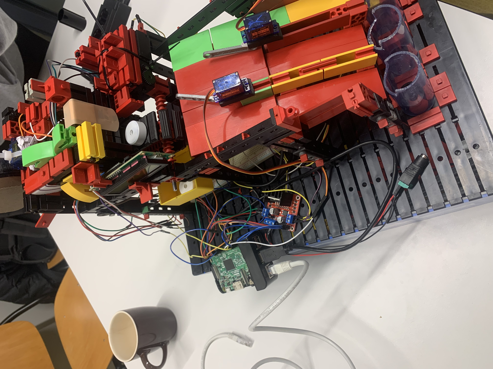
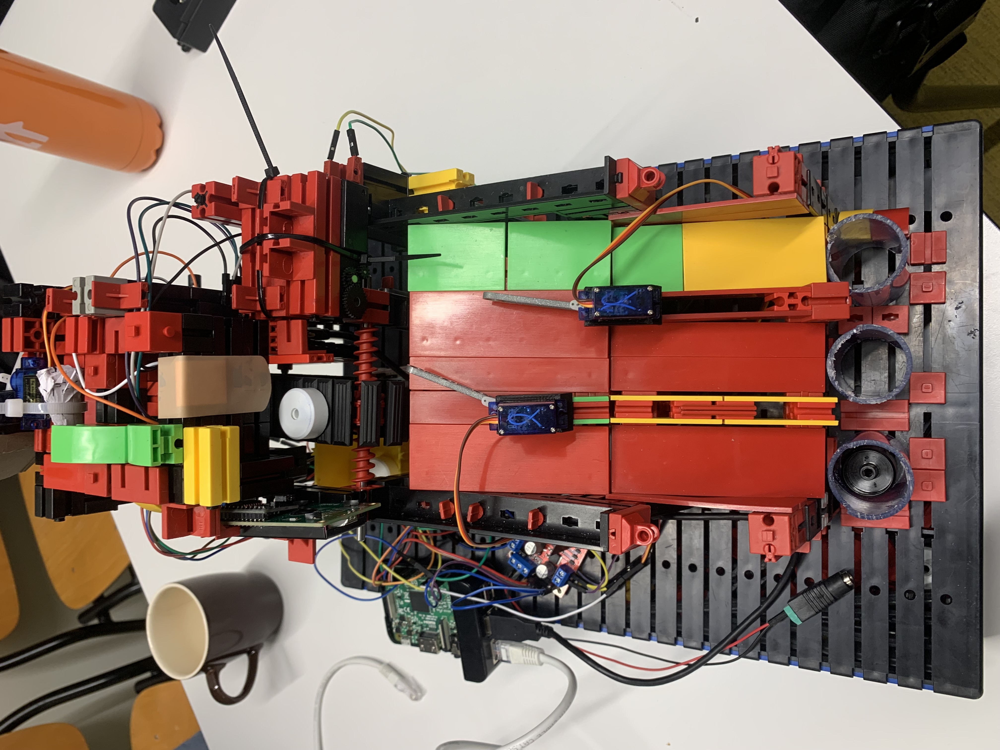

# Cargo Handling System
## About
This robot is part of the Embeded Systems course in TU/e. We utilize RP, Arduino, a number of sensors and motors and Fischer Technik elements to create a robust "luggage" sorting robot. The software is written entirely in Rust. For more documentation consult `/documents`. 

## Details
The object is placed on a conveyor belt using a special ramp. The entrance is then shut off (when distance sensor detects something) and conveyor belt is moved. 
The color sensor scans for color values (if it doesn't succeed then has *reanalysis* procedure), and based on them either discards the element or sorts into one of three possible outputs. 

## Looks
| |  |
| -------- | ------- |
|   | |
